# Диаграммы архитектуры URL Shortener

Данный документ содержит визуализации различных аспектов микросервисной архитектуры проекта в формате Mermaid.

## Содержание

1. [Общая архитектура системы](#1-общая-архитектура-системы)
2. [Диаграмма развертывания](#2-диаграмма-развертывания)
3. [Последовательность аутентификации](#3-последовательность-аутентификации)
4. [Миграция гостевого аккаунта](#4-миграция-гостевого-аккаунта)
5. [Создание и редирект ссылки](#5-создание-и-редирект-ссылки)
6. [Событийная архитектура](#6-событийная-архитектура)
7. [CI/CD Pipeline](#8-cicd-pipeline)
8. [Kubernetes архитектура](#9-kubernetes-архитектура)

---

## 1. Общая архитектура системы

### 1.1 Компонентная диаграмма

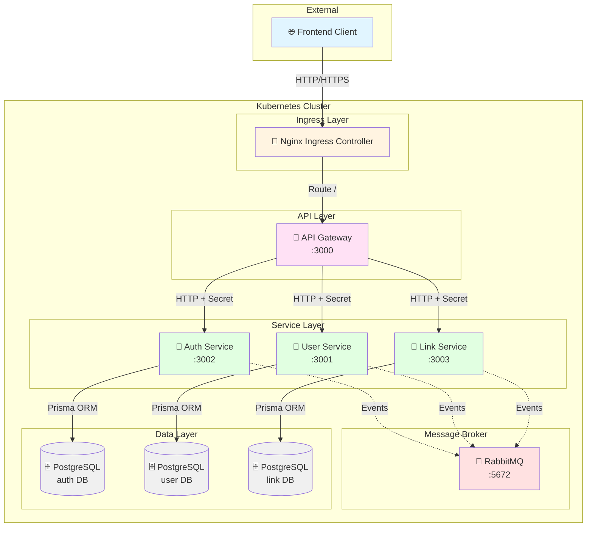
```mermaid
graph TB
    subgraph "External"
        Client[🌐 Frontend Client]
    end

    subgraph "Kubernetes Cluster"
        subgraph "Ingress Layer"
            Ingress[🚪 Nginx Ingress Controller]
        end

        subgraph "API Layer"
            Gateway[📡 API Gateway<br/>:3000]
        end

        subgraph "Service Layer"
            AuthSvc[🔐 Auth Service<br/>:3002]
            UserSvc[👤 User Service<br/>:3001]
            LinkSvc[🔗 Link Service<br/>:3003]
        end

        subgraph "Message Broker"
            RabbitMQ[🐰 RabbitMQ<br/>:5672]
        end

        subgraph "Data Layer"
            AuthDB[(🗄️ PostgreSQL<br/>auth DB)]
            UserDB[(🗄️ PostgreSQL<br/>user DB)]
            LinkDB[(🗄️ PostgreSQL<br/>link DB)]
        end
    end

    Client -->|HTTP/HTTPS| Ingress
    Ingress -->|Route /| Gateway

    Gateway -->|HTTP + Secret| AuthSvc
    Gateway -->|HTTP + Secret| UserSvc
    Gateway -->|HTTP + Secret| LinkSvc

    AuthSvc -.->|Events| RabbitMQ
    UserSvc -.->|Events| RabbitMQ
    LinkSvc -.->|Events| RabbitMQ

    AuthSvc -->|Prisma ORM| AuthDB
    UserSvc -->|Prisma ORM| UserDB
    LinkSvc -->|Prisma ORM| LinkDB

    style Client fill:#e1f5ff
    style Ingress fill:#fff4e1
    style Gateway fill:#ffe1f5
    style AuthSvc fill:#e1ffe1
    style UserSvc fill:#e1ffe1
    style LinkSvc fill:#e1ffe1
    style RabbitMQ fill:#ffe1e1
    style AuthDB fill:#f0f0f0
    style UserDB fill:#f0f0f0
    style LinkDB fill:#f0f0f0
```

### 1.2 Сетевая топология

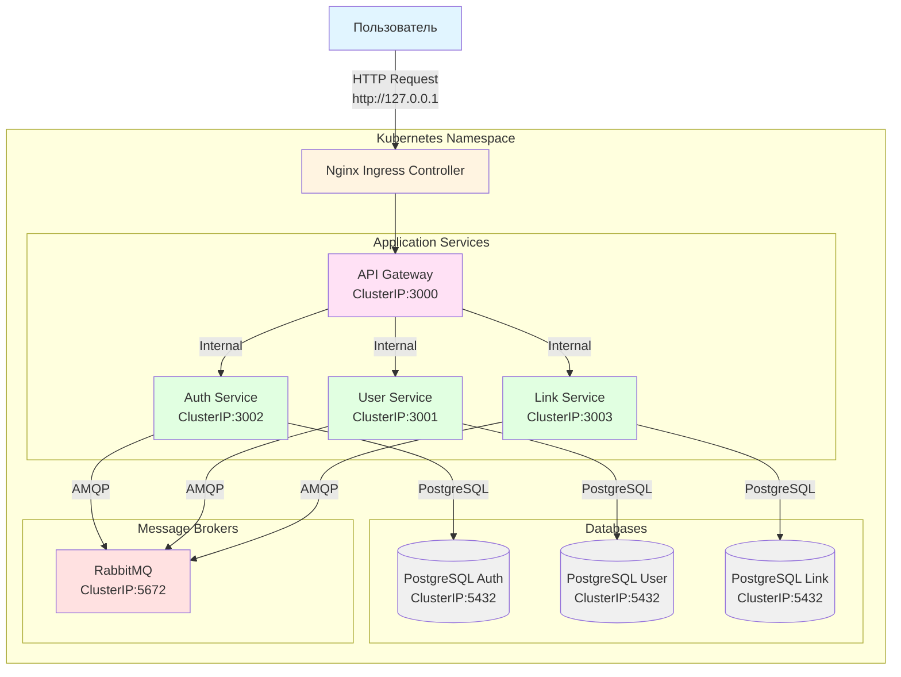
```mermaid
graph TB
    user[Пользователь]

    subgraph "Kubernetes Namespace"
        Ingress[Nginx Ingress Controller]

        subgraph "Application Services"
            Gateway[API Gateway<br/>ClusterIP:3000]
            User[User Service<br/>ClusterIP:3001]
            Auth[Auth Service<br/>ClusterIP:3002]
            Link[Link Service<br/>ClusterIP:3003]
        end

        subgraph "Databases"
            AuthDB[(PostgreSQL Auth<br/>ClusterIP:5432)]
            UserDB[(PostgreSQL User<br/>ClusterIP:5432)]
            LinkDB[(PostgreSQL Link<br/>ClusterIP:5432)]
        end

        subgraph "Message Brokers"
            MQ[RabbitMQ<br/>ClusterIP:5672]
        end
    end
    user -->|HTTP Request <br/> http://127.0.0.1| Ingress
    Ingress --> Gateway
    Gateway -->|Internal| User
    Gateway -->|Internal| Auth
    Gateway -->|Internal| Link
    Auth -->|AMQP| MQ
    User -->|AMQP| MQ
    Link -->|AMQP| MQ
    Auth -->|PostgreSQL| AuthDB
    User -->|PostgreSQL| UserDB
    Link -->|PostgreSQL| LinkDB

    style user fill:#e1f5ff
    style Ingress fill:#fff4e1
    style Gateway fill:#ffe1f5
    style Auth fill:#e1ffe1
    style User fill:#e1ffe1
    style Link fill:#e1ffe1
    style MQ fill:#ffe1e1
    style AuthDB fill:#f0f0f0
    style UserDB fill:#f0f0f0
    style LinkDB fill:#f0f0f0
```

### 1.3 Схема маршрутизации через Ingress к API-Gateway

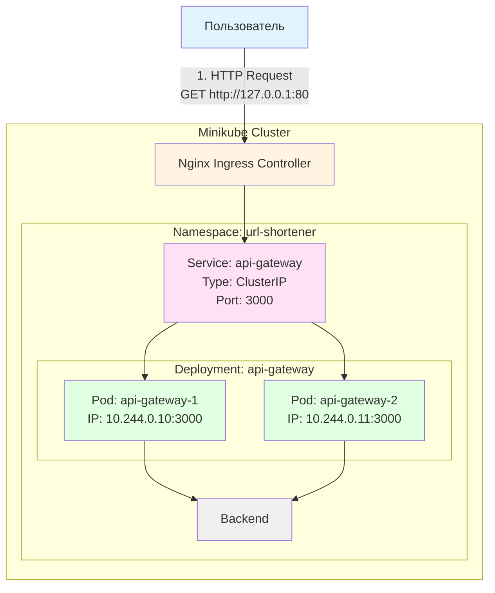
```mermaid
graph TB
    User[Пользователь]

    subgraph "Minikube Cluster"
        Ingress[Nginx Ingress Controller]

        subgraph "Namespace: url-shortener"
            Service[Service: api-gateway<br/>Type: ClusterIP<br/>Port: 3000]

            subgraph "Deployment: api-gateway"
                Pod1[Pod: api-gateway-1<br/>IP: 10.244.0.10:3000]
                Pod2[Pod: api-gateway-2<br/>IP: 10.244.0.11:3000]
            end
            Backend
        end
    end

    User -->|1. HTTP Request<br/>GET http://127.0.0.1:80| Ingress
    Ingress --> Service
    Service --> Pod1
    Service --> Pod2
    Pod1 --> Backend
    Pod2 --> Backend

    style User fill:#e1f5ff
    style Ingress fill:#fff4e1
    style Service fill:#ffe1f5
    style Pod1 fill:#e1ffe1
    style Pod2 fill:#e1ffe1
    style Backend fill:#f0f0f0
```

---

## 2. Диаграмма развертывания

### 2.1 Docker Compose (Локальная разработка)

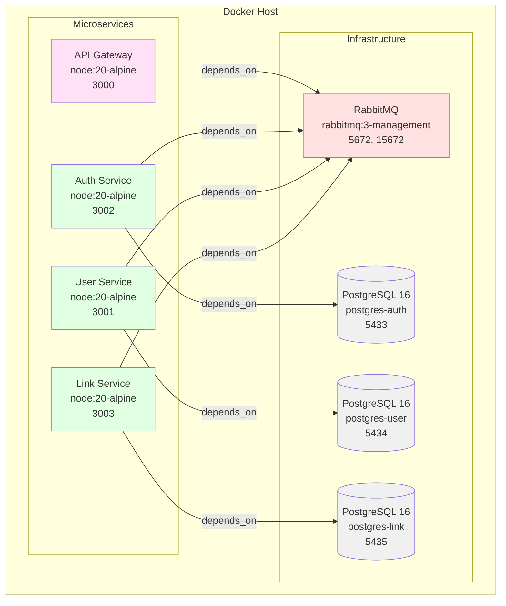
```mermaid
graph TB
    subgraph "Docker Host"
        subgraph "Infrastructure"
            RMQ[RabbitMQ<br/>rabbitmq:3-management<br/>5672, 15672]
            PG1[(PostgreSQL 16<br/>postgres-auth<br/>5433)]
            PG2[(PostgreSQL 16<br/>postgres-user<br/>5434)]
            PG3[(PostgreSQL 16<br/>postgres-link<br/>5435)]
        end

        subgraph "Microservices"
            GW[API Gateway<br/>node:20-alpine<br/>3000]
            AS[Auth Service<br/>node:20-alpine<br/>3002]
            US[User Service<br/>node:20-alpine<br/>3001]
            LS[Link Service<br/>node:20-alpine<br/>3003]
        end
    end

    GW -->|depends_on| RMQ
    AS -->|depends_on| RMQ
    AS -->|depends_on| PG1
    US -->|depends_on| RMQ
    US -->|depends_on| PG2
    LS -->|depends_on| RMQ
    LS -->|depends_on| PG3

    style RMQ fill:#ffe1e1
    style PG1 fill:#f0f0f0
    style PG2 fill:#f0f0f0
    style PG3 fill:#f0f0f0
    style GW fill:#ffe1f5
    style AS fill:#e1ffe1
    style US fill:#e1ffe1
    style LS fill:#e1ffe1
```

## 3. Последовательность аутентификации

### 3.1 Регистрация пользователя (без гостя)

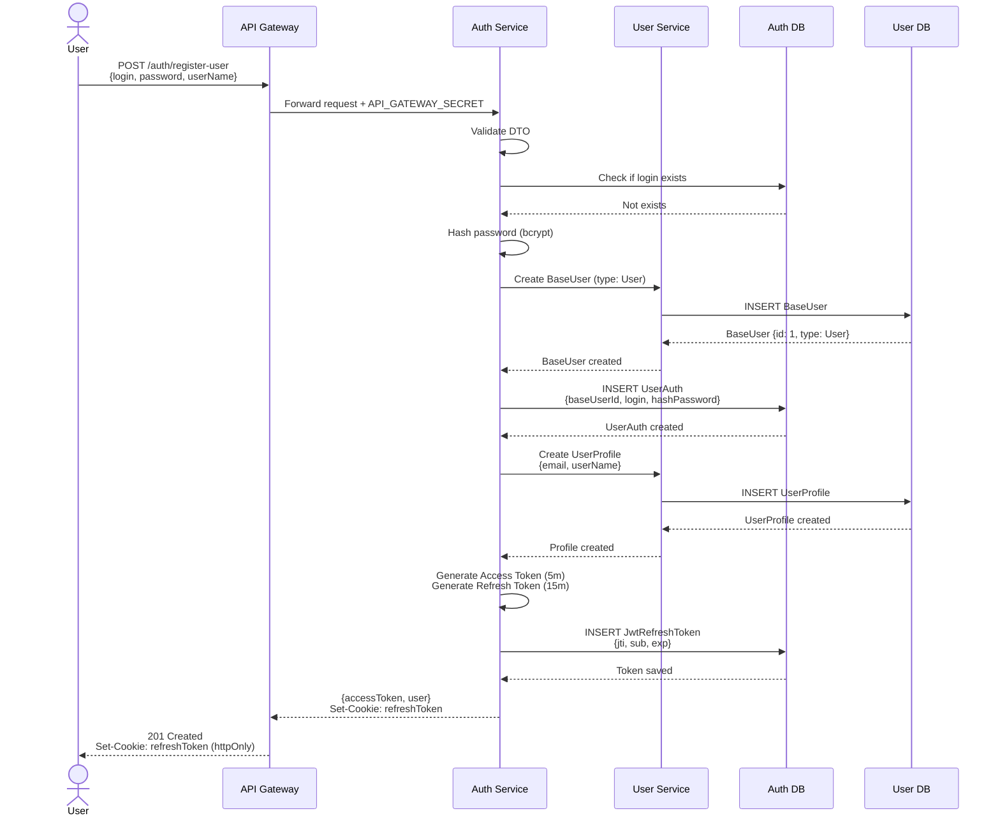
```mermaid
sequenceDiagram
    actor User
    participant Gateway as API Gateway
    participant Auth as Auth Service
    participant UserSvc as User Service
    participant AuthDB as Auth DB
    participant UserDB as User DB

    User->>Gateway: POST /auth/register-user<br/>{login, password, userName}
    Gateway->>Auth: Forward request + API_GATEWAY_SECRET

    Auth->>Auth: Validate DTO
    Auth->>AuthDB: Check if login exists
    AuthDB-->>Auth: Not exists

    Auth->>Auth: Hash password (bcrypt)
    Auth->>UserSvc: Create BaseUser (type: User)
    UserSvc->>UserDB: INSERT BaseUser
    UserDB-->>UserSvc: BaseUser {id: 1, type: User}
    UserSvc-->>Auth: BaseUser created

    Auth->>AuthDB: INSERT UserAuth<br/>{baseUserId, login, hashPassword}
    AuthDB-->>Auth: UserAuth created

    Auth->>UserSvc: Create UserProfile<br/>{email, userName}
    UserSvc->>UserDB: INSERT UserProfile
    UserDB-->>UserSvc: UserProfile created
    UserSvc-->>Auth: Profile created

    Auth->>Auth: Generate Access Token (5m)<br/>Generate Refresh Token (15m)
    Auth->>AuthDB: INSERT JwtRefreshToken<br/>{jti, sub, exp}
    AuthDB-->>Auth: Token saved

    Auth-->>Gateway: {accessToken, user}<br/>Set-Cookie: refreshToken
    Gateway-->>User: 201 Created<br/>Set-Cookie: refreshToken (httpOnly)
```

### 3.2 Логин пользователя

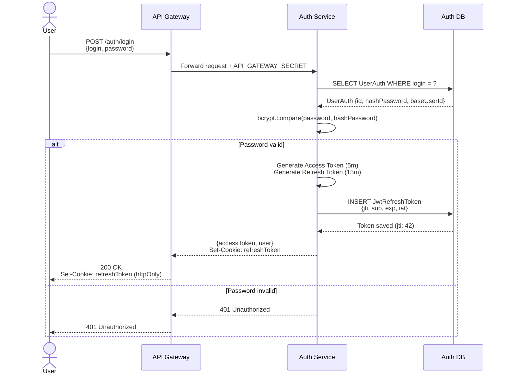
```mermaid
sequenceDiagram
    actor User
    participant Gateway as API Gateway
    participant Auth as Auth Service
    participant AuthDB as Auth DB

    User->>Gateway: POST /auth/login<br/>{login, password}
    Gateway->>Auth: Forward request + API_GATEWAY_SECRET

    Auth->>AuthDB: SELECT UserAuth WHERE login = ?
    AuthDB-->>Auth: UserAuth {id, hashPassword, baseUserId}

    Auth->>Auth: bcrypt.compare(password, hashPassword)

    alt Password valid
        Auth->>Auth: Generate Access Token (5m)<br/>Generate Refresh Token (15m)
        Auth->>AuthDB: INSERT JwtRefreshToken<br/>{jti, sub, exp, iat}
        AuthDB-->>Auth: Token saved (jti: 42)

        Auth-->>Gateway: {accessToken, user}<br/>Set-Cookie: refreshToken
        Gateway-->>User: 200 OK<br/>Set-Cookie: refreshToken (httpOnly)
    else Password invalid
        Auth-->>Gateway: 401 Unauthorized
        Gateway-->>User: 401 Unauthorized
    end
```

### 3.3 Refresh Token Flow

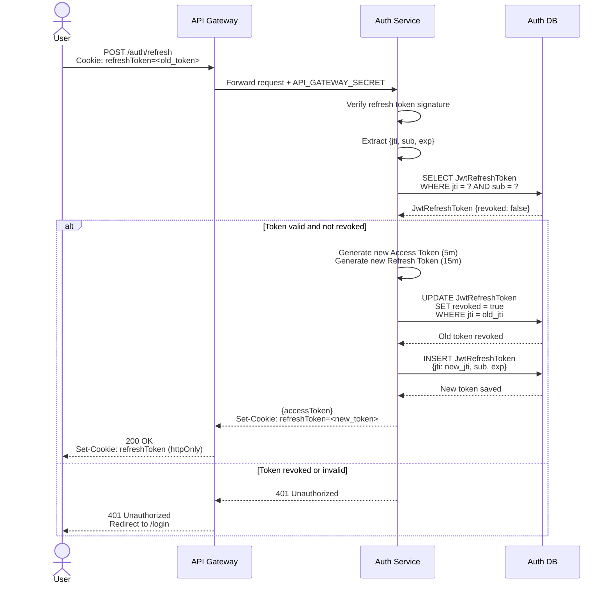
```mermaid
sequenceDiagram
    actor User
    participant Gateway as API Gateway
    participant Auth as Auth Service
    participant AuthDB as Auth DB

    User->>Gateway: POST /auth/refresh<br/>Cookie: refreshToken=<old_token>
    Gateway->>Auth: Forward request + API_GATEWAY_SECRET

    Auth->>Auth: Verify refresh token signature
    Auth->>Auth: Extract {jti, sub, exp}

    Auth->>AuthDB: SELECT JwtRefreshToken<br/>WHERE jti = ? AND sub = ?
    AuthDB-->>Auth: JwtRefreshToken {revoked: false}

    alt Token valid and not revoked
        Auth->>Auth: Generate new Access Token (5m)<br/>Generate new Refresh Token (15m)

        Auth->>AuthDB: UPDATE JwtRefreshToken<br/>SET revoked = true<br/>WHERE jti = old_jti
        AuthDB-->>Auth: Old token revoked

        Auth->>AuthDB: INSERT JwtRefreshToken<br/>{jti: new_jti, sub, exp}
        AuthDB-->>Auth: New token saved

        Auth-->>Gateway: {accessToken}<br/>Set-Cookie: refreshToken=<new_token>
        Gateway-->>User: 200 OK<br/>Set-Cookie: refreshToken (httpOnly)
    else Token revoked or invalid
        Auth-->>Gateway: 401 Unauthorized
        Gateway-->>User: 401 Unauthorized<br/>Redirect to /login
    end
```

### 3.4 Dual Authentication (JWT + Guest UUID)

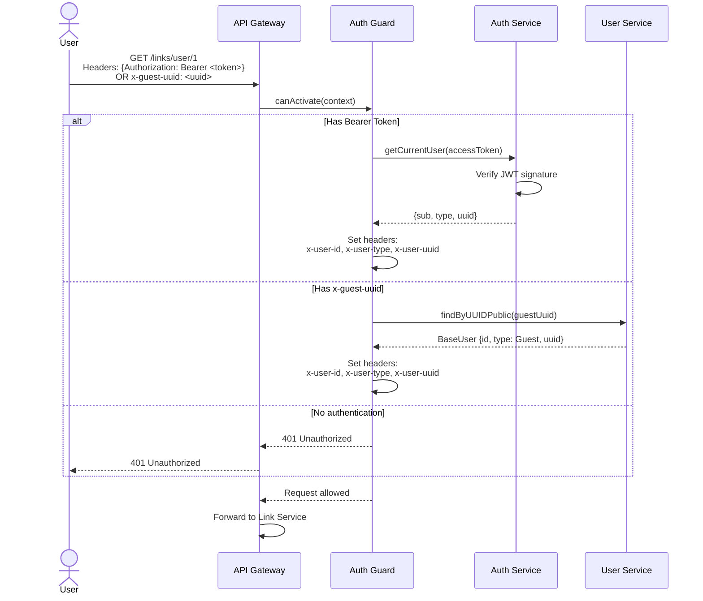
```mermaid
sequenceDiagram
    actor User
    participant Gateway as API Gateway
    participant AuthGuard as Auth Guard
    participant Auth as Auth Service
    participant UserSvc as User Service

    User->>Gateway: GET /links/user/1<br/>Headers: {Authorization: Bearer <token>}<br/>OR x-guest-uuid: <uuid>

    Gateway->>AuthGuard: canActivate(context)

    alt Has Bearer Token
        AuthGuard->>Auth: getCurrentUser(accessToken)
        Auth->>Auth: Verify JWT signature
        Auth-->>AuthGuard: {sub, type, uuid}
        AuthGuard->>AuthGuard: Set headers:<br/>x-user-id, x-user-type, x-user-uuid
    else Has x-guest-uuid
        AuthGuard->>UserSvc: findByUUIDPublic(guestUuid)
        UserSvc-->>AuthGuard: BaseUser {id, type: Guest, uuid}
        AuthGuard->>AuthGuard: Set headers:<br/>x-user-id, x-user-type, x-user-uuid
    else No authentication
        AuthGuard-->>Gateway: 401 Unauthorized
        Gateway-->>User: 401 Unauthorized
    end

    AuthGuard-->>Gateway: Request allowed
    Gateway->>Gateway: Forward to Link Service
```

---

## 4. Миграция гостевого аккаунта

### 4.1 Создание гостя

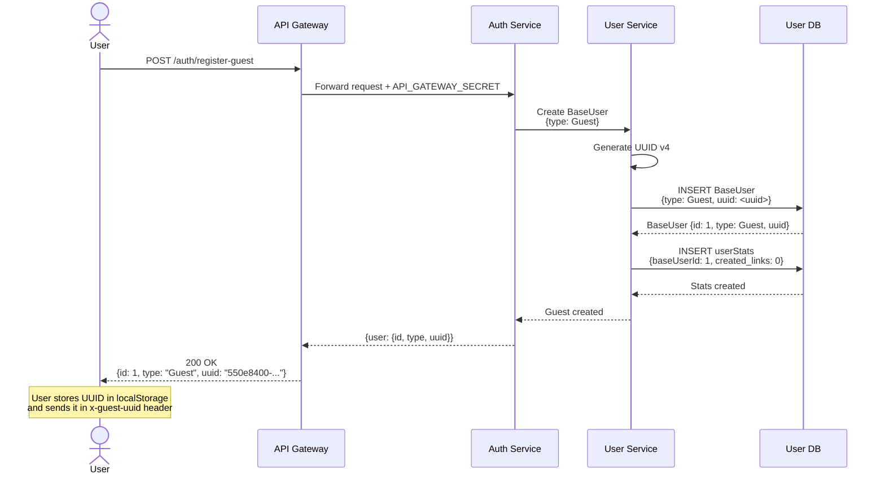
```mermaid
sequenceDiagram
    actor User
    participant Gateway as API Gateway
    participant Auth as Auth Service
    participant UserSvc as User Service
    participant UserDB as User DB

    User->>Gateway: POST /auth/register-guest
    Gateway->>Auth: Forward request + API_GATEWAY_SECRET

    Auth->>UserSvc: Create BaseUser<br/>{type: Guest}
    UserSvc->>UserSvc: Generate UUID v4
    UserSvc->>UserDB: INSERT BaseUser<br/>{type: Guest, uuid: <uuid>}
    UserDB-->>UserSvc: BaseUser {id: 1, type: Guest, uuid}

    UserSvc->>UserDB: INSERT userStats<br/>{baseUserId: 1, created_links: 0}
    UserDB-->>UserSvc: Stats created

    UserSvc-->>Auth: Guest created
    Auth-->>Gateway: {user: {id, type, uuid}}
    Gateway-->>User: 200 OK<br/>{id: 1, type: "Guest", uuid: "550e8400-..."}

    Note over User: User stores UUID in localStorage<br/>and sends it in x-guest-uuid header
```

### 4.2 Регистрация с миграцией гостя

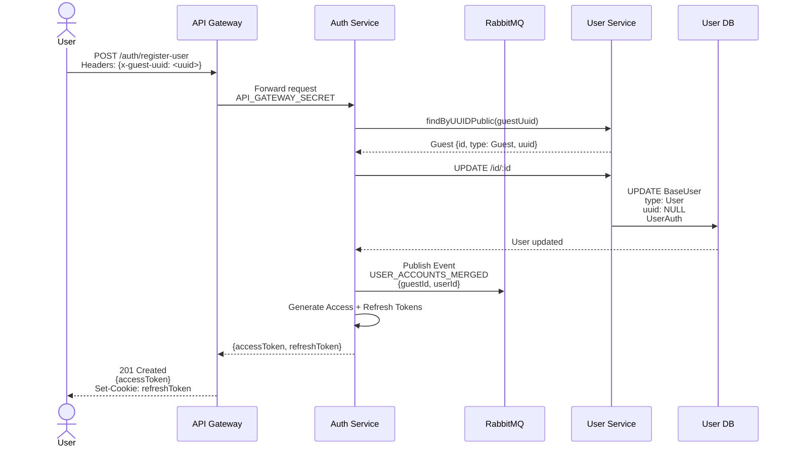
```mermaid
sequenceDiagram
    actor User
    participant Gateway as API Gateway
    participant Auth as Auth Service
    participant RabbitMQ
    participant UserSvc as User Service
    participant UserDB as User DB

    User->>Gateway: POST /auth/register-user<br/>Headers: {x-guest-uuid: <uuid>}
    Gateway->>Auth: Forward request <br/> API_GATEWAY_SECRET

    Auth->>UserSvc: findByUUIDPublic(guestUuid)
    UserSvc-->>Auth: Guest {id, type: Guest, uuid}

    Auth->>UserSvc: UPDATE /id/:id
    UserSvc->>UserDB: UPDATE BaseUser<br/>type: User<br/>uuid: NULL<br/>UserAuth
    UserDB-->>Auth: User updated

    Auth->>RabbitMQ: Publish Event<br/>USER_ACCOUNTS_MERGED<br/>{guestId, userId}

    Auth->>Auth: Generate Access + Refresh Tokens


    Auth-->>Gateway: {accessToken, refreshToken}
    Gateway-->>User: 201 Created<br/>{accessToken}<br/>Set-Cookie: refreshToken
```

### 4.3 Логин с миграцией гостя

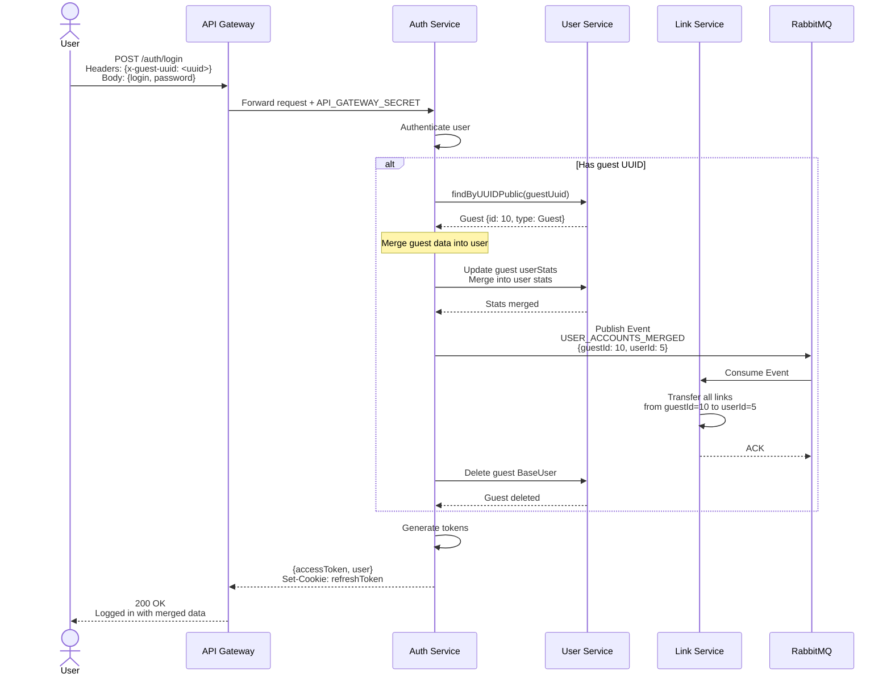
```mermaid
sequenceDiagram
    actor User
    participant Gateway as API Gateway
    participant Auth as Auth Service
    participant UserSvc as User Service
    participant LinkSvc as Link Service
    participant RabbitMQ

    User->>Gateway: POST /auth/login<br/>Headers: {x-guest-uuid: <uuid>}<br/>Body: {login, password}
    Gateway->>Auth: Forward request + API_GATEWAY_SECRET

    Auth->>Auth: Authenticate user

    alt Has guest UUID
        Auth->>UserSvc: findByUUIDPublic(guestUuid)
        UserSvc-->>Auth: Guest {id: 10, type: Guest}

        Note over Auth: Merge guest data into user

        Auth->>UserSvc: Update guest userStats<br/>Merge into user stats
        UserSvc-->>Auth: Stats merged

        Auth->>RabbitMQ: Publish Event<br/>USER_ACCOUNTS_MERGED<br/>{guestId: 10, userId: 5}

        RabbitMQ->>LinkSvc: Consume Event
        LinkSvc->>LinkSvc: Transfer all links<br/>from guestId=10 to userId=5
        LinkSvc-->>RabbitMQ: ACK

        Auth->>UserSvc: Delete guest BaseUser
        UserSvc-->>Auth: Guest deleted
    end

    Auth->>Auth: Generate tokens
    Auth-->>Gateway: {accessToken, user}<br/>Set-Cookie: refreshToken
    Gateway-->>User: 200 OK<br/>Logged in with merged data
```

---

## 5. Создание и редирект ссылки

### 5.1 Создание короткой ссылки

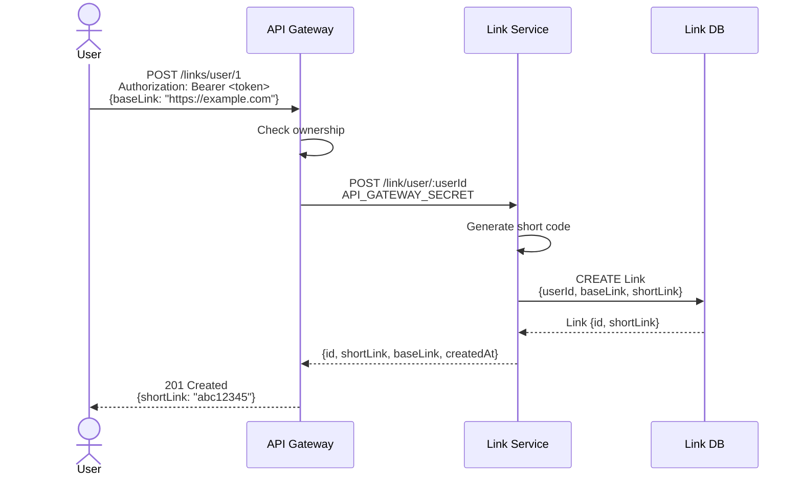
```mermaid
sequenceDiagram
    actor User
    participant Gateway as API Gateway
    participant LinkSvc as Link Service
    participant LinkDB as Link DB

    User->>Gateway: POST /links/user/1<br/>Authorization: Bearer <token><br/>{baseLink: "https://example.com"}

    Gateway->>Gateway: Check ownership

    Gateway->>LinkSvc: POST /link/user/:userId<br/>API_GATEWAY_SECRET

    LinkSvc->>LinkSvc: Generate short code


    LinkSvc->>LinkDB: CREATE Link<br/>{userId, baseLink, shortLink}
    LinkDB-->>LinkSvc: Link {id, shortLink}

    LinkSvc-->>Gateway: {id, shortLink, baseLink, createdAt}
    Gateway-->>User: 201 Created<br/>{shortLink: "abc12345"}
```

### 5.2 Перенаправление по короткой ссылке

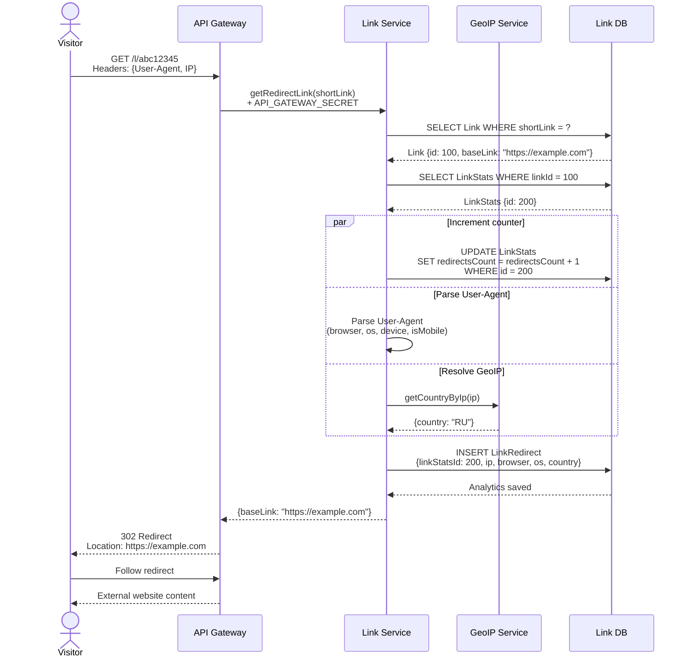
```mermaid
sequenceDiagram
    actor Visitor
    participant Gateway as API Gateway
    participant LinkSvc as Link Service
    participant GeoIP as GeoIP Service
    participant LinkDB as Link DB

    Visitor->>Gateway: GET /l/abc12345<br/>Headers: {User-Agent, IP}

    Gateway->>LinkSvc: getRedirectLink(shortLink)<br/>+ API_GATEWAY_SECRET

    LinkSvc->>LinkDB: SELECT Link WHERE shortLink = ?
    LinkDB-->>LinkSvc: Link {id: 100, baseLink: "https://example.com"}

    LinkSvc->>LinkDB: SELECT LinkStats WHERE linkId = 100
    LinkDB-->>LinkSvc: LinkStats {id: 200}

    par Increment counter
        LinkSvc->>LinkDB: UPDATE LinkStats<br/>SET redirectsCount = redirectsCount + 1<br/>WHERE id = 200
    and Parse User-Agent
        LinkSvc->>LinkSvc: Parse User-Agent<br/>(browser, os, device, isMobile)
    and Resolve GeoIP
        LinkSvc->>GeoIP: getCountryByIp(ip)
        GeoIP-->>LinkSvc: {country: "RU"}
    end

    LinkSvc->>LinkDB: INSERT LinkRedirect<br/>{linkStatsId: 200, ip, browser, os, country}
    LinkDB-->>LinkSvc: Analytics saved

    LinkSvc-->>Gateway: {baseLink: "https://example.com"}
    Gateway-->>Visitor: 302 Redirect<br/>Location: https://example.com

    Visitor->>Gateway: Follow redirect
    Gateway-->>Visitor: External website content
```

---

## 6. Событийная архитектура

### 6.1 Event Flow Diagram

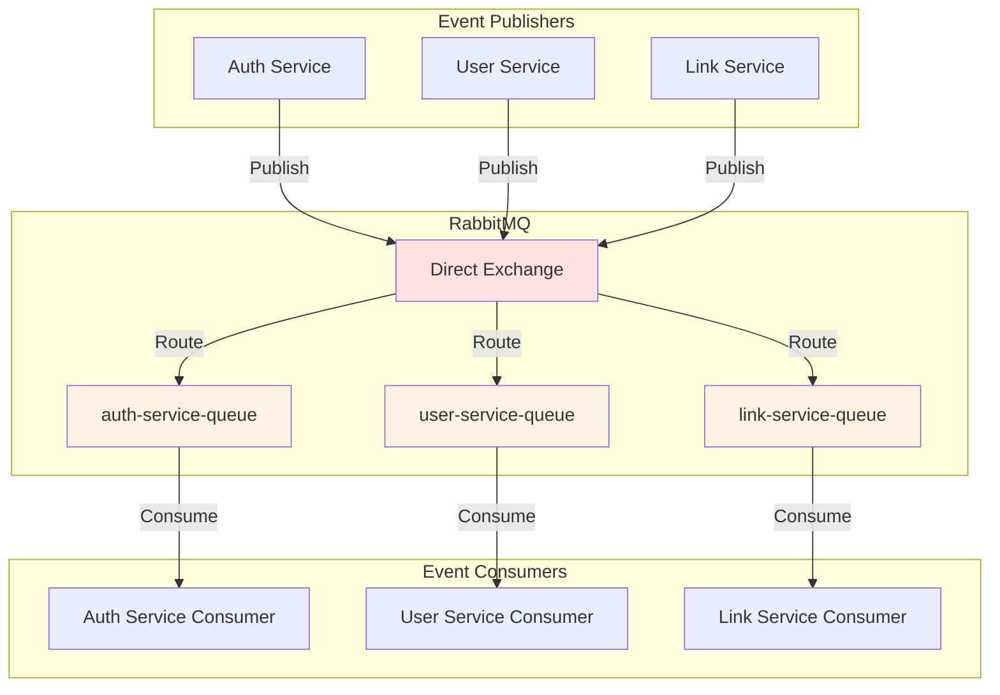
```mermaid
graph TB
    subgraph "Event Publishers"
        Auth[Auth Service]
        User[User Service]
        Link[Link Service]
    end

    subgraph "RabbitMQ"
        Exchange[Direct Exchange]
        Q1[auth-service-queue]
        Q2[user-service-queue]
        Q3[link-service-queue]
    end

    subgraph "Event Consumers"
        AuthC[Auth Service Consumer]
        UserC[User Service Consumer]
        LinkC[Link Service Consumer]
    end

    Auth -->|Publish| Exchange
    User -->|Publish| Exchange
    Link -->|Publish| Exchange

    Exchange -->|Route| Q1
    Exchange -->|Route| Q2
    Exchange -->|Route| Q3

    Q1 -->|Consume| AuthC
    Q2 -->|Consume| UserC
    Q3 -->|Consume| LinkC

    style Exchange fill:#ffe1e1
    style Q1 fill:#fff4e1
    style Q2 fill:#fff4e1
    style Q3 fill:#fff4e1
```

### 6.2 USER_DELETED Event Flow

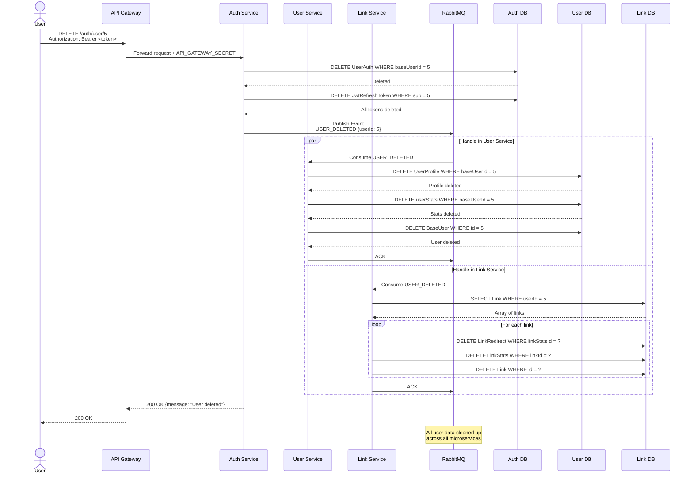
```mermaid
sequenceDiagram
    actor User
    participant Gateway as API Gateway
    participant Auth as Auth Service
    participant UserSvc as User Service
    participant LinkSvc as Link Service
    participant RabbitMQ
    participant AuthDB as Auth DB
    participant UserDB as User DB
    participant LinkDB as Link DB

    User->>Gateway: DELETE /auth/user/5<br/>Authorization: Bearer <token>
    Gateway->>Auth: Forward request + API_GATEWAY_SECRET

    Auth->>AuthDB: DELETE UserAuth WHERE baseUserId = 5
    AuthDB-->>Auth: Deleted

    Auth->>AuthDB: DELETE JwtRefreshToken WHERE sub = 5
    AuthDB-->>Auth: All tokens deleted

    Auth->>RabbitMQ: Publish Event<br/>USER_DELETED {userId: 5}

    par Handle in User Service
        RabbitMQ->>UserSvc: Consume USER_DELETED
        UserSvc->>UserDB: DELETE UserProfile WHERE baseUserId = 5
        UserDB-->>UserSvc: Profile deleted
        UserSvc->>UserDB: DELETE userStats WHERE baseUserId = 5
        UserDB-->>UserSvc: Stats deleted
        UserSvc->>UserDB: DELETE BaseUser WHERE id = 5
        UserDB-->>UserSvc: User deleted
        UserSvc->>RabbitMQ: ACK
    and Handle in Link Service
        RabbitMQ->>LinkSvc: Consume USER_DELETED
        LinkSvc->>LinkDB: SELECT Link WHERE userId = 5
        LinkDB-->>LinkSvc: Array of links

        loop For each link
            LinkSvc->>LinkDB: DELETE LinkRedirect WHERE linkStatsId = ?
            LinkSvc->>LinkDB: DELETE LinkStats WHERE linkId = ?
            LinkSvc->>LinkDB: DELETE Link WHERE id = ?
        end

        LinkSvc->>RabbitMQ: ACK
    end

    Auth-->>Gateway: 200 OK {message: "User deleted"}
    Gateway-->>User: 200 OK

    Note over RabbitMQ: All user data cleaned up<br/>across all microservices
```

### 6.3 USER_ACCOUNTS_MERGED Event Flow

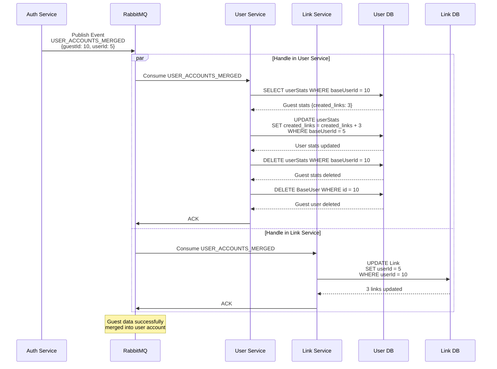
```mermaid
sequenceDiagram
    participant Auth as Auth Service
    participant RabbitMQ
    participant UserSvc as User Service
    participant LinkSvc as Link Service
    participant UserDB as User DB
    participant LinkDB as Link DB

    Auth->>RabbitMQ: Publish Event<br/>USER_ACCOUNTS_MERGED<br/>{guestId: 10, userId: 5}

    par Handle in User Service
        RabbitMQ->>UserSvc: Consume USER_ACCOUNTS_MERGED

        UserSvc->>UserDB: SELECT userStats WHERE baseUserId = 10
        UserDB-->>UserSvc: Guest stats {created_links: 3}

        UserSvc->>UserDB: UPDATE userStats<br/>SET created_links = created_links + 3<br/>WHERE baseUserId = 5
        UserDB-->>UserSvc: User stats updated

        UserSvc->>UserDB: DELETE userStats WHERE baseUserId = 10
        UserDB-->>UserSvc: Guest stats deleted

        UserSvc->>UserDB: DELETE BaseUser WHERE id = 10
        UserDB-->>UserSvc: Guest user deleted

        UserSvc->>RabbitMQ: ACK
    and Handle in Link Service
        RabbitMQ->>LinkSvc: Consume USER_ACCOUNTS_MERGED

        LinkSvc->>LinkDB: UPDATE Link<br/>SET userId = 5<br/>WHERE userId = 10
        LinkDB-->>LinkSvc: 3 links updated

        LinkSvc->>RabbitMQ: ACK
    end

    Note over RabbitMQ: Guest data successfully<br/>merged into user account
```

---

## 8. CI/CD Pipeline

### 8.1 GitHub Actions Workflow

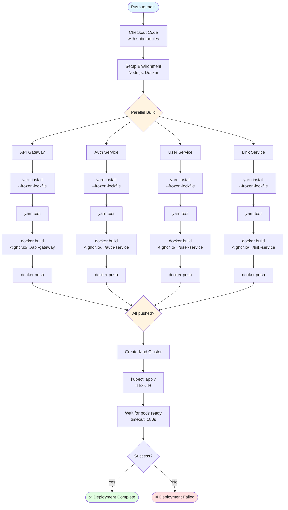
```mermaid
graph TB
    Start([Push to main]) --> Checkout[Checkout Code<br/>with submodules]
    Checkout --> Setup[Setup Environment<br/>Node.js, Docker]

    Setup --> Parallel{Parallel Build}

    Parallel --> Gateway[API Gateway]
    Parallel --> Auth[Auth Service]
    Parallel --> User[User Service]
    Parallel --> Link[Link Service]

    Gateway --> GW_Install[yarn install<br/>--frozen-lockfile]
    Auth --> AS_Install[yarn install<br/>--frozen-lockfile]
    User --> US_Install[yarn install<br/>--frozen-lockfile]
    Link --> LS_Install[yarn install<br/>--frozen-lockfile]

    GW_Install --> GW_Test[yarn test]
    AS_Install --> AS_Test[yarn test]
    US_Install --> US_Test[yarn test]
    LS_Install --> LS_Test[yarn test]

    GW_Test --> GW_Build[docker build<br/>-t ghcr.io/.../api-gateway]
    AS_Test --> AS_Build[docker build<br/>-t ghcr.io/.../auth-service]
    US_Test --> US_Build[docker build<br/>-t ghcr.io/.../user-service]
    LS_Test --> LS_Build[docker build<br/>-t ghcr.io/.../link-service]

    GW_Build --> GW_Push[docker push]
    AS_Build --> AS_Push[docker push]
    US_Build --> US_Push[docker push]
    LS_Build --> LS_Push[docker push]

    GW_Push --> Merge{All pushed?}
    AS_Push --> Merge
    US_Push --> Merge
    LS_Push --> Merge

    Merge --> K8s_Setup[Create Kind Cluster]
    K8s_Setup --> K8s_Apply[kubectl apply<br/>-f k8s -R]
    K8s_Apply --> K8s_Wait[Wait for pods ready<br/>timeout: 180s]

    K8s_Wait --> Success{Success?}
    Success -->|Yes| End([✅ Deployment Complete])
    Success -->|No| Failed([❌ Deployment Failed])

    style Start fill:#e1f5ff
    style End fill:#e1ffe1
    style Failed fill:#ffe1e1
    style Parallel fill:#fff4e1
    style Merge fill:#fff4e1
```

### 8.2 Docker Build Pipeline

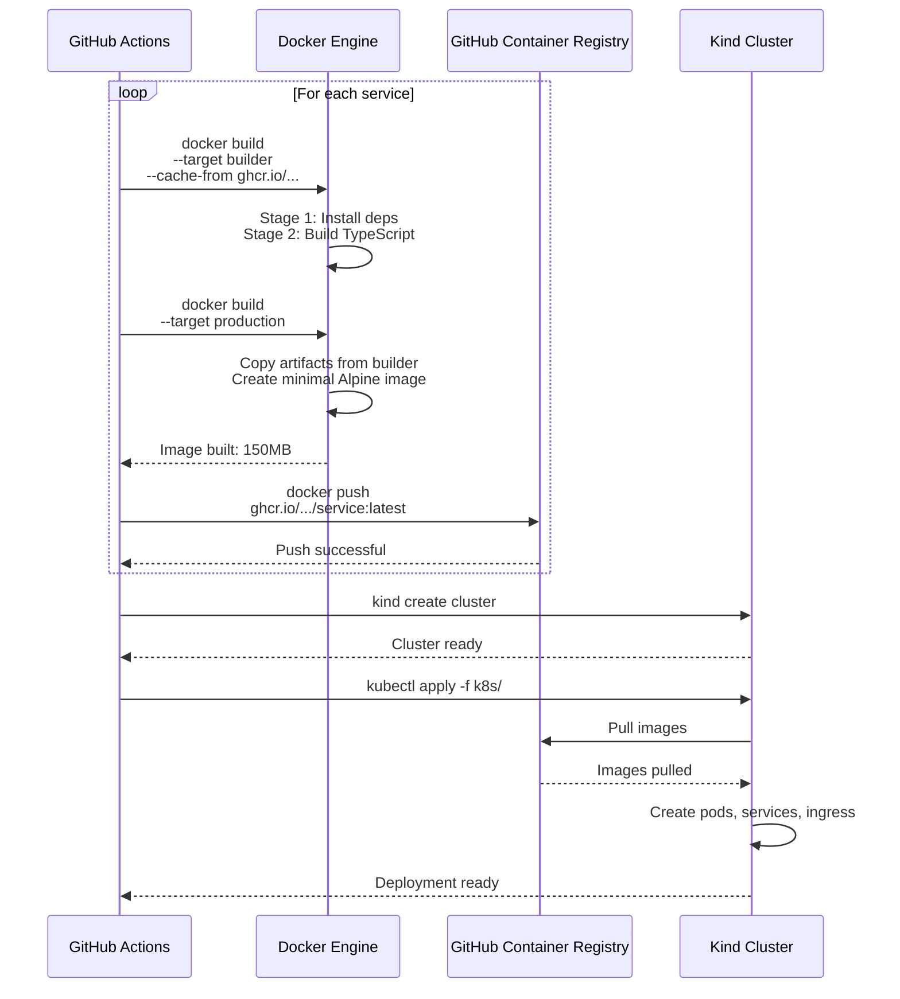
```mermaid
sequenceDiagram
    participant GHA as GitHub Actions
    participant Docker as Docker Engine
    participant GHCR as GitHub Container Registry
    participant Kind as Kind Cluster

    loop For each service
        GHA->>Docker: docker build<br/>--target builder<br/>--cache-from ghcr.io/...
        Docker->>Docker: Stage 1: Install deps<br/>Stage 2: Build TypeScript

        GHA->>Docker: docker build<br/>--target production
        Docker->>Docker: Copy artifacts from builder<br/>Create minimal Alpine image

        Docker-->>GHA: Image built: 150MB

        GHA->>GHCR: docker push<br/>ghcr.io/.../service:latest
        GHCR-->>GHA: Push successful
    end

    GHA->>Kind: kind create cluster
    Kind-->>GHA: Cluster ready

    GHA->>Kind: kubectl apply -f k8s/
    Kind->>GHCR: Pull images
    GHCR-->>Kind: Images pulled

    Kind->>Kind: Create pods, services, ingress
    Kind-->>GHA: Deployment ready
```

## Заключение

Данные диаграммы покрывают все ключевые аспекты микросервисной архитектуры проекта URL Shortener:

✅ **Архитектура:** Общая структура, компоненты, сетевая топология  
✅ **Развертывание:** Docker Compose, Kubernetes  
✅ **Аутентификация:** JWT, гостевой режим, миграция аккаунтов  
✅ **Функционал:** Создание ссылок, редиректы, статистика  
✅ **События:** RabbitMQ, асинхронная коммуникация  
✅ **Базы данных:** ERD для 3 PostgreSQL инстансов  
✅ **CI/CD:** GitHub Actions, автоматическое развертывание  
✅ **Kubernetes:** Service Discovery, HPA, Rolling Updates  
✅ **Сессии:** Многоустройственная аутентификация, управление токенами

Все диаграммы в формате Mermaid можно рендерить в GitHub, VS Code (с расширением), или любом Markdown редакторе с поддержкой Mermaid.
