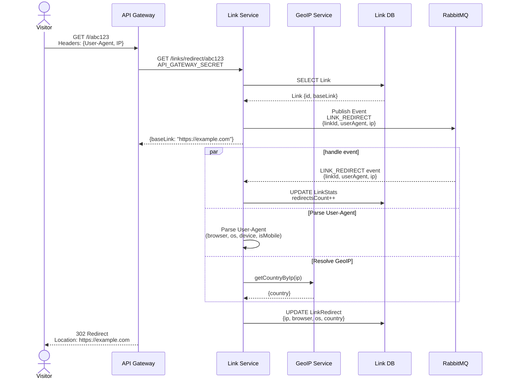

# Диаграммы архитектуры URL Shortener

Данный документ содержит визуализации различных аспектов микросервисной архитектуры проекта в формате Mermaid.

## Содержание

1. [Общая архитектура системы](#1-общая-архитектура-системы)
2. [Диаграмма развертывания](#2-диаграмма-развертывания)
3. [Последовательность аутентификации](#3-последовательность-аутентификации)
4. [Миграция гостевого аккаунта](#4-миграция-гостевого-аккаунта)
5. [Создание и редирект ссылки](#5-создание-и-редирект-ссылки)
6. [Событийная архитектура](#6-событийная-архитектура)
7. [CI/CD Pipeline](#7-cicd-pipeline)

---

## 1. Общая архитектура системы

### 1.1 Сетевая топология


### 1.2 Схема маршрутизации через Ingress к API-Gateway


---

## 2. Диаграмма развертывания

### 2.1 Docker Compose (Локальная разработка)


## 3. Последовательность аутентификации

### 3.1 Регистрация пользователя (без гостя)


### 3.2 Логин пользователя


### 3.3 Refresh Token Flow


### 3.4 Dual Authentication (JWT + Guest UUID)


---

## 4. Миграция гостевого аккаунта

### 4.1 Создание гостя


### 4.2 Регистрация с миграцией гостя


### 4.3 Логин с миграцией гостя


---

## 5. Создание и редирект ссылки

### 5.1 Создание короткой ссылки


### 5.2 Перенаправление по короткой ссылке



---

## 6. Событийная архитектура

### 6.1 Event Flow Diagram


### 6.2 USER_DELETED Event Flow


### 6.3 USER_ACCOUNTS_MERGED Event Flow


---

## 7. CI/CD Pipeline

### 7.1 GitHub Actions Workflow

````mermaid
graph TD
    Start([Push to main]) --> Job1[Job 1: Run Tests<br/>Matrix: 4 services in parallel]

    Job1 -->|Success| Job2[Job 2: Build & Push Images<br/>Matrix: 4 Docker images in parallel]
    Job1 -->|Failure| Failed([❌ Pipeline Failed])

    Job2 -->|Success| Job3[Job 3: Deploy to Kubernetes]
    Job2 -->|Failure| Failed

    Job3 --> K8s_1[Create Kind Cluster]
    K8s_1 --> K8s_2[Apply Namespace & Secrets]
    K8s_2 --> K8s_3[Deploy Databases & RabbitMQ]
    K8s_3 --> K8s_4[Deploy Microservices & Ingress]

    K8s_4 -->|Success| End([✅ Deployment Complete])
    K8s_4 -->|Failure| Failed

    style Start fill:#e1f5ff
    style Job1 fill:#fff4e1
    style Job2 fill:#fff4e1
    style Job3 fill:#fff4e1
    style End fill:#e1ffe1
    style Failed fill:#ffe1e1
```### 7.2 Docker Build Pipeline

```mermaid
sequenceDiagram
    participant GHA as GitHub Actions
    participant Docker as Docker Engine
    participant GHCR as GitHub Container Registry
    participant Kind as Kind Cluster

    loop For each service
        GHA->>Docker: docker build<br/>--target builder<br/>--cache-from ghcr.io/...
        Docker->>Docker: Stage 1: Install deps<br/>Stage 2: Build TypeScript

        GHA->>Docker: docker build<br/>--target production
        Docker->>Docker: Copy artifacts from builder<br/>Create minimal Alpine image

        Docker-->>GHA: Image built: 150MB

        GHA->>GHCR: docker push<br/>ghcr.io/.../service:latest
        GHCR-->>GHA: Push successful
    end

    GHA->>Kind: kind create cluster
    Kind-->>GHA: Cluster ready

    GHA->>Kind: kubectl apply -f k8s/
    Kind->>GHCR: Pull images
    GHCR-->>Kind: Images pulled

    Kind->>Kind: Create pods, services, ingress
    Kind-->>GHA: Deployment ready
````
