# Architecture Diagram

## System Architecture (Mermaid)


## Authentication Flow

```mermaid
sequenceDiagram
    participant C as Client
    participant G as API Gateway
    participant A as Auth Service
    participant DB as PostgreSQL Auth

    C->>G: POST /auth/register
    G->>A: Forward request
    A->>DB: Create user
    DB-->>A: User created
    A->>A: Generate JWT tokens
    A-->>G: Access + Refresh tokens
    G-->>C: Tokens + User data

    Note over C: Store tokens

    C->>G: POST /links (with Access token)
    G->>G: Verify token
    alt Token valid
        G->>Link: Forward request
        Link-->>G: Response
        G-->>C: Success
    else Token expired
        G-->>C: 401 Unauthorized
        C->>G: POST /auth/refresh (with Refresh token)
        G->>A: Refresh request
        A->>DB: Verify refresh token
        DB-->>A: Valid
        A->>A: Generate new tokens
        A-->>G: New tokens
        G-->>C: New Access + Refresh tokens
    end
```

## Link Creation Flow


## Kubernetes Resources


## CI/CD Pipeline


## Deployment Order

```mermaid
graph TD
    Start[Start Deployment] --> NS[1. Create Namespace]
    NS --> CM[2. Apply ConfigMaps & Secrets]
    CM --> RMQ[3. Deploy RabbitMQ]
    RMQ --> WaitRMQ{Wait for<br/>RabbitMQ Ready}
    WaitRMQ -->|Ready| DBs[4. Deploy PostgreSQL Databases]
    WaitRMQ -->|Not Ready| WaitRMQ
    DBs --> WaitDB{Wait for<br/>All DBs Ready}
    WaitDB -->|Ready| Auth[5. Deploy Auth Service]
    WaitDB -->|Not Ready| WaitDB
    Auth --> User[6. Deploy User Service]
    User --> Link[7. Deploy Link Service]
    Link --> WaitSvc{Wait for<br/>Services Ready}
    WaitSvc -->|Ready| GW[8. Deploy API Gateway]
    WaitSvc -->|Not Ready| WaitSvc
    GW --> Ing[9. Apply Ingress]
    Ing --> Done[Deployment Complete ✓]

    style Start fill:#90EE90
    style Done fill:#98FB98
    style WaitRMQ fill:#FFE4B5
    style WaitDB fill:#FFE4B5
    style WaitSvc fill:#FFE4B5
```



## Network Communication


## Data Models Overview


## Technology Stack


